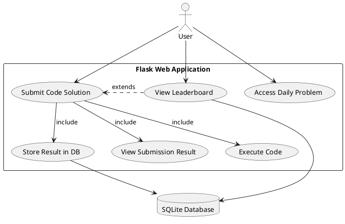
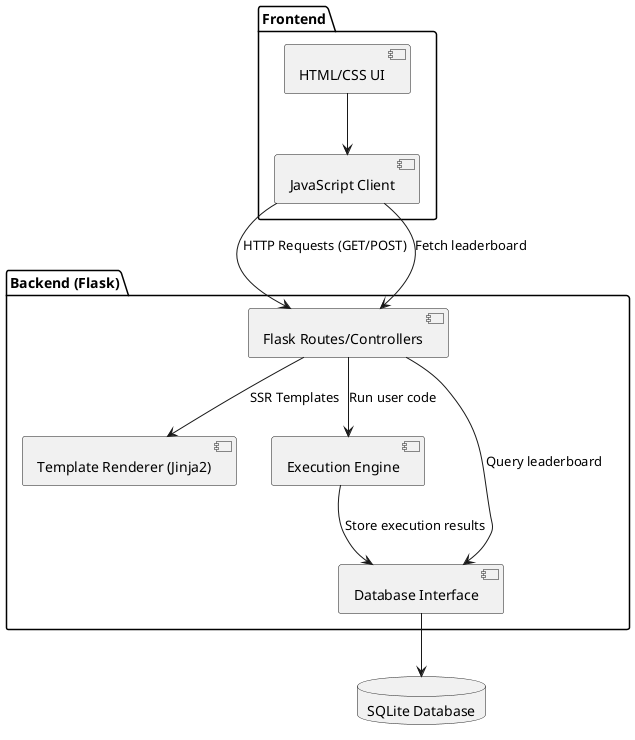
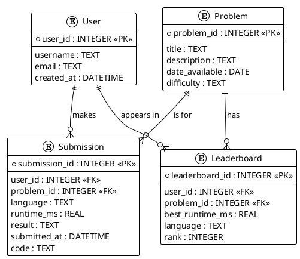
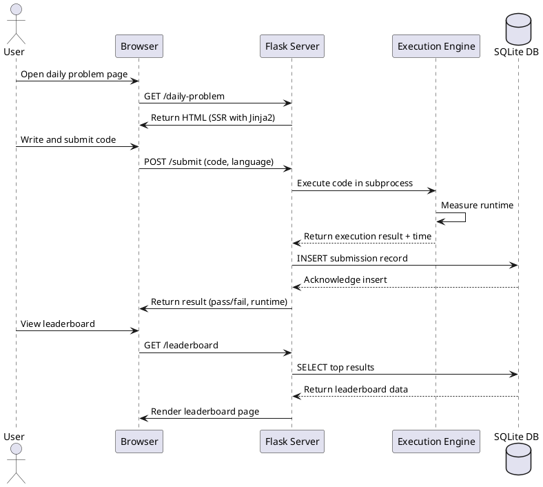

# Leetle Architecture Document
Team 10 
Team Members: Daniel Neugent, Brett Balquist, Tej Gumaste, Jay Patel, Arnav Jain 
Project Name: Leetle 
Project Synopsis: We are creating a webapp where people can do daily Leetcode questions similar to Wordle. 

## Architecture description   
For this project, our goal is to design and implement a web application using Flask that enables users to interact with a graphical user interface and solve daily programming challenges. The concept is inspired by the popular word puzzle game Wordle, owned by the New York Times, but instead of guessing words, users will attempt to solve coding challenges. The platform aims to combine the fun, daily engagement of Wordle with the technical challenge of solving algorithmic problems similar to those found on LeetCode. Users will be able to write and submit code directly through the website, and the system will execute and evaluate their solutions automatically, ranking participants based on their solution performance.

User use case diagram
### Overall System Design 
The system will follow a client-server architecture, with Flask serving as the backend framework responsible for handling routing, executing user-submitted code, managing the database, and rendering server-side templates. On the client side, we will use a combination of HTML, CSS, and JavaScript to provide an interactive and intuitive user interface. While modern frontend frameworks like React or Vue could have been considered, we have decided to stick with a simpler, more lightweight approach that integrates naturally with Flask’s server-side rendering (SSR) model. This approach reduces complexity, avoids unnecessary dependencies, and keeps the project within a manageable scope. 

The web app will be structured around a few key pages: 

1. Home Page – introduces the concept and allows users to access the daily problem. 
2. Problem Page – provides the daily coding challenge, input fields for code submission, and the interface for selecting programming languages. 
3. Leaderboard Page – displays performance rankings, showcasing the best times and solutions from different users. 
Each page will be rendered dynamically using Flask’s Jinja2 templating system, ensuring that the content updates daily and reflects new challenges. 

### Backend Architecture 
The backend will be the core of our system. Flask will manage user requests, serve HTML templates, and process submissions. When a user submits their code, the backend will handle execution in a secure, sandboxed subprocess environment. The code execution process will be timed using Python’s subprocess and time modules, ensuring accurate measurement of execution time. This metric will serve as the basis for ranking users on the leaderboard. 

Since security is a major concern when executing user-submitted code, we will need to implement safeguards to prevent malicious behavior. The system will restrict access to system resources and file I/O, and each code submission will run in a temporary isolated environment. This can be achieved through sandboxing techniques such as using restricted Python environments or containers. For this project’s scale, we may start with subprocess management and restricted input validation, while noting that a production system would require more robust sandboxing (such as Docker or Firejail). 

### Database Design 
We will use SQLite as our database engine. It is lightweight, easy to set up, and well-suited for small-scale applications like this one. The database will store information about: 
- User identifiers (username or generated ID) 
- The programming language used 
- The problem attempted 
- The code execution time 
- The submission timestamp 
This data will be stored in a submissions table and queried to build the leaderboard. Flask’s built-in support for SQLite makes it straightforward to integrate database operations within the app using the sqlite3 module or an ORM such as SQLAlchemy (though for simplicity we may interact directly with raw SQL queries). 

### Leaderboard and Ranking Logic 
The leaderboard will be an essential part of the user experience, encouraging competition and engagement. When users submit their code, their results will be stored in the database and later fetched for display. The leaderboard will rank users based on the total execution time of their code, with ties broken by submission time. It will also display the language used, which may allow for interesting comparisons between languages (e.g., Python vs. C++ performance). Rankings will be recalculated dynamically each time a user visits the leaderboard page, ensuring that users always see the most up-to-date results. 

### Frontend and User Interaction 
On the frontend, users will interact primarily through the problem-solving interface. This interface will feature a code editor area (which could be implemented as a basic \<textarea> or enhanced using a lightweight JavaScript code editor library like CodeMirror). Users will be able to select from several programming languages—likely Python, JavaScript, and C++ for the initial implementation. Once the code is submitted, the frontend will send it to the Flask backend through a POST request, where it will be executed, and the results will be returned. The response will include whether the solution passed or failed and how long it took to execute. The total runtime and ranking updates will be shown to the user without needing to reload the page, achieved through asynchronous JavaScript (AJAX) calls. 

### Scheduling and Problem Management 
Problems will be hardcoded on the backend and released based on the system date. This ensures predictability and allows all users to tackle the same problem on a given day, mirroring the “daily challenge” model of Wordle. Problems will not be randomly generated, as that would complicate validation and testing. Over time, we can add more problems manually and configure a schedule that automatically rotates through them. 

### Conclusion 
In summary, our web application combines backend-driven architecture with a clean, minimal frontend to create an engaging platform for daily coding challenges. Flask will handle routing, execution, and data persistence, while HTML, CSS, and JavaScript provide a simple yet effective user interface. SQLite will maintain persistent leaderboard data, and the server will manage code execution safely and efficiently. The result will be an educational and competitive platform where users can improve their coding skills in a fun and interactive way.